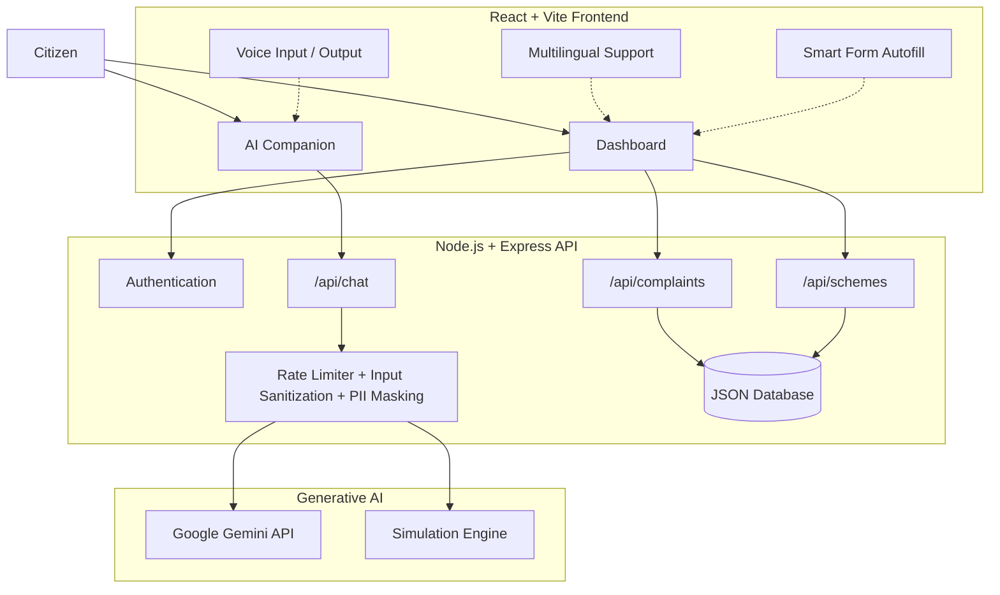

# 🏛️ CivicCompanion - AI-Powered Civic Platform

CivicCompanion is an award-winning civic portal that makes government interactions simple, transparent, and accessible. It solves citizen pain points—such as digital exclusion, language barriers, complex bureaucratic terminology, and issue tracking—by pairing a beautiful modern dashboard with a proactive, voice-enabled, agentic AI Companion.

---
## ✨ SysteM Architecture


## ✨ Features (The Hackathon "Wow" List)

1. **Agentic Form Filling (WebMCP Inspired)**: When the citizen explains an issue or demographic parameters to the AI Companion, the AI extracts structured JSON details and presents an **Autofill Current Form** action drawer. Clicking this populates forms on the page automatically, easing digital literacy barriers.
2. **Real-time Multilingual & Speech Support**: The platform instantly translates UI text into English, Spanish, Hindi, or French. Combined with the Web Speech API, citizens can speak their questions and hear the AI companion read responses aloud.
3. **Emergency Severity Triage**: Input descriptions are checked for safety threats (e.g. exposed utility cables). If detected, the platform escalates the ticket severity to `Critical` and highlights it for rapid response.
4. **Interactive Document Checklist**: Recommends public subsidies based on residency and income. For eligible schemes, it generates interactive checklists where users can mock-upload files to simulate AI scans.
5. **State Transition Simulators**: An interactive "Advance State" utility on the ticket logs lets judges simulate municipal workflow updates in real-time.

---

## 🛠️ API Reference

### 1. AI Chat Routing
* **Endpoint**: `POST /api/chat`
* **Security**: Rate limited (20 requests/min), PII scrubbed.
* **Payload**:
```json
{
  "sessionId": "session-12345",
  "message": "I live at 4th street and want to report a broken streetlight.",
  "locale": "en"
}
```
* **Response**:
```json
{
  "reply": "I can help you report this streetlight issue...",
  "intent": "REPORT_COMPLAINT",
  "extractedData": {
    "title": "Broken Streetlight",
    "category": "Public Lighting",
    "description": "I live at 4th street and want to report a broken streetlight.",
    "location": "4th street",
    "severity": "Low",
    "priority": "Low"
  },
  "userContext": {}
}
```

### 2. Schemes & Subsidy Finder
* **Endpoint**: `POST /api/schemes/recommend`
* **Payload**:
```json
{
  "age": 28,
  "income": 45000,
  "ownsHome": false,
  "residency": true
}
```
* **Response**:
```json
{
  "recommendations": [
    {
      "id": "scheme-3",
      "name": "Empower Youth Digital Literacy Grant",
      "eligible": true,
      "matchReasons": [
        "You fully satisfy all demographic and housing requirements!"
      ]
    }
  ]
}
```

### 3. Public Issue Reporting
* **Endpoint**: `POST /api/complaints`
* **Payload**:
```json
{
  "title": "Pothole on Oak Ave",
  "category": "Roads & Infrastructure",
  "description": "Large asphalt crater near the corner.",
  "location": "Oak Ave",
  "severity": "Medium",
  "priority": "Medium"
}
```

---

## 🚀 Setup & Installation

### Option A: Run locally (Recommended for Dev)

1. **Install Server Dependencies**:
   ```bash
   cd server
   npm install
   ```
2. **Install Client Dependencies**:
   ```bash
   cd ../client
   npm install
   ```
3. **Configure Environment**:
   Create a `.env` file in the root directory:
   ```env
   GEMINI_API_KEY=your_actual_key_here
   PORT=5001
   ```
4. **Launch Application**:
   Run the backend and frontend servers in separate terminals:
   * **Terminal 1 (Backend)**: `cd server && npm run dev`
   * **Terminal 2 (Frontend)**: `cd client && npm run dev`
5. Open browser at `http://localhost:3000`.

### Option B: Build and Run with Docker

1. Build and boot the stack:
   ```bash
   docker-compose up --build
   ```
2. Open `http://localhost:5001`. (Vite assets will build and bundle directly inside the production Node container).

## 🌐 Live Demo

**Live Application:** https://civic-companion.onrender.com
